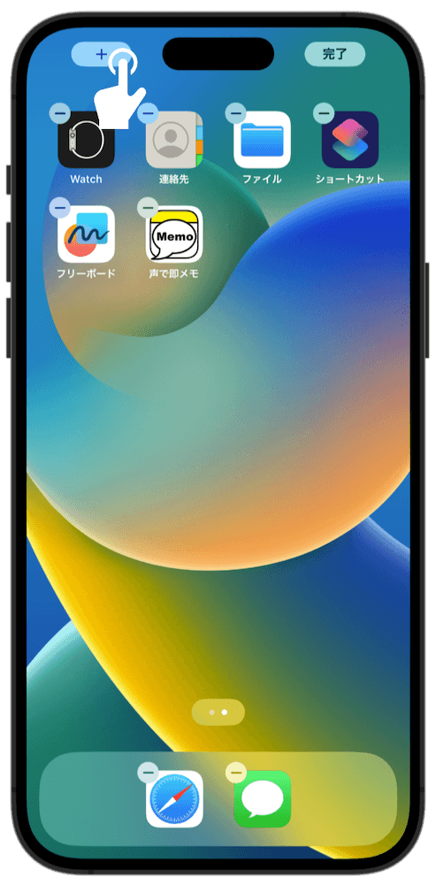
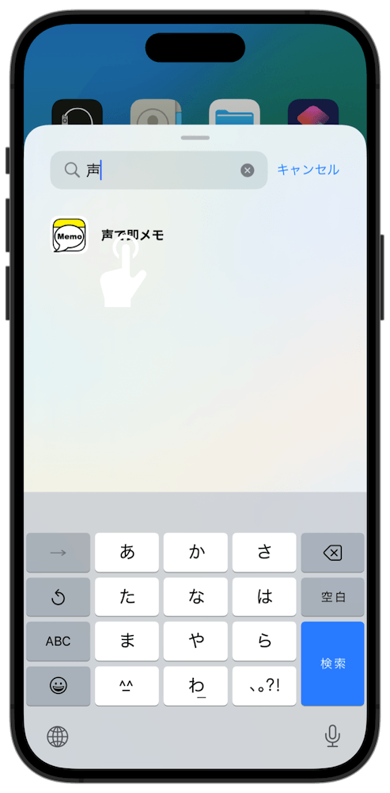
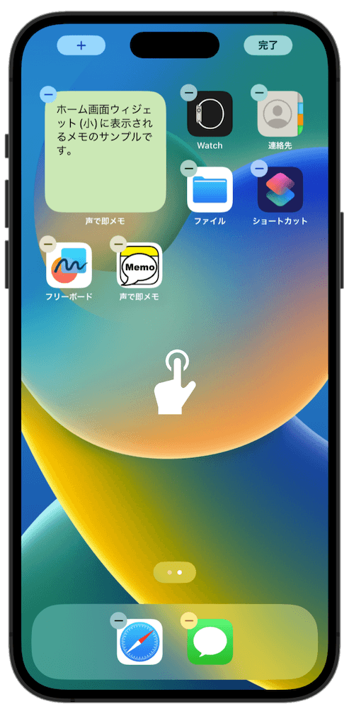
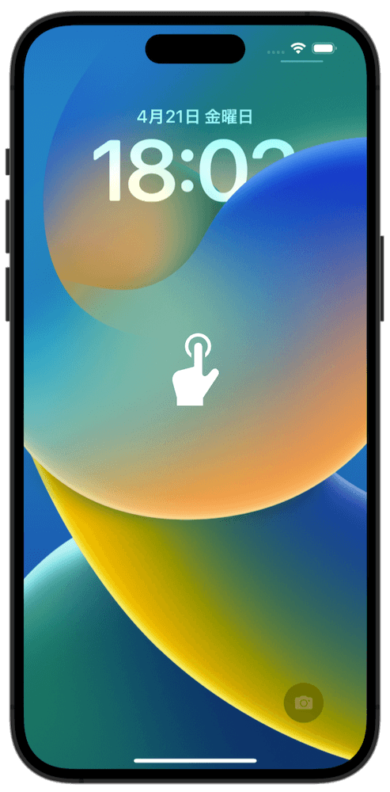
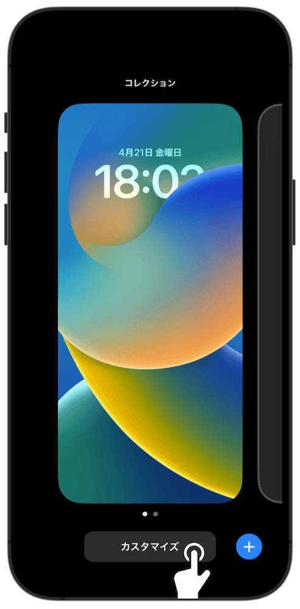
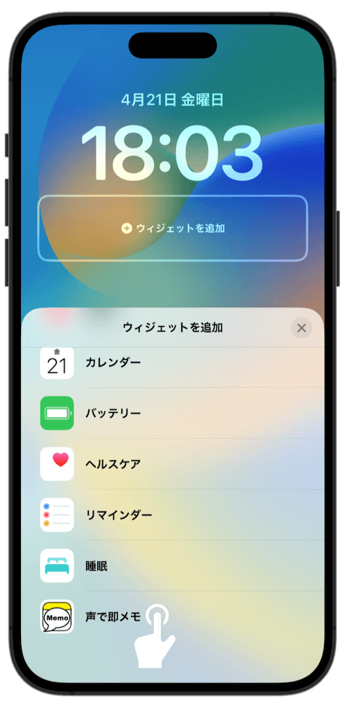
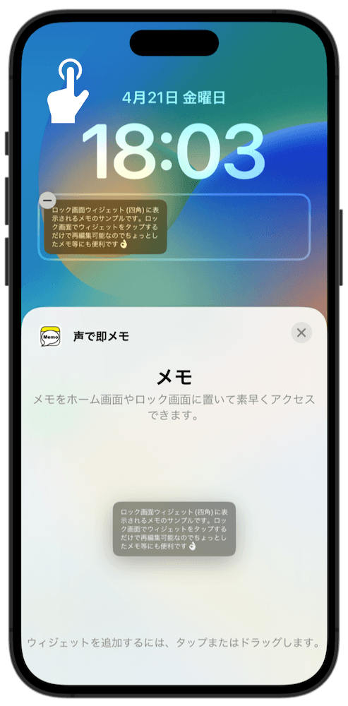
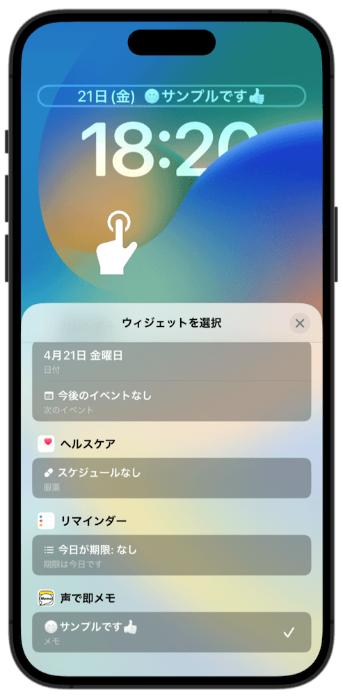
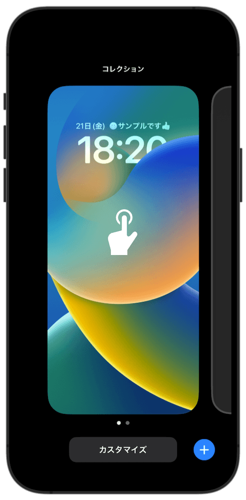

### 声で即メモ　アプリの使い方

#### ウィジェットの追加

メモは、以下の方法でホーム画面やロック画面(iOS16のみ)にウィジェットとして追加できます。追加したウィジェットをタップするだけでメモを開始できます。

ホーム画面への追加方法

 

- ホーム画面を長押しします

- 左上の +ボタン をタップします

- "声で即メモ"を検索してタップします

- スワイプして好みのサイズを選びます

- 青い決定ボタンをタップします

- ホーム画面をタップして完了です

ロック画面への追加方法 (四角メモ)

 

- ロック画面を長押しします

- 「カスタマイズ」をタップします

- 「ロック画面」の方をタップします

- 「ウィジェットを追加」の部分をタップします

- "声で即メモ"を検索してタップします

- ウィジェットをタップします

- ロック画面をタップして確定します

- 「完了」をタップします

- ロック画面をタップします

- これで追加完了です
- ロック画面のウィジェットをタップすると、

- アプリのメモ画面が表示されます

ロック画面への追加方法 (1行メモ)

 

- ロック画面を長押しします

- 「カスタマイズ」をタップします

- 「ロック画面」の方をタップします

- 日時が表示されている部分をタップします

- "声で即メモ"を検索してタップします

- ロック画面をタップして確定します

- 「完了」をタップします

- ロック画面をタップします

- これで追加完了です
- ロック画面のウィジェットをタップすると、

- アプリのメモ画面が表示されます

#### ハンズフリーモード

iPhone/iPadに触れずに音声操作で繰り返しメモするためのモードです。

##### 利用のための準備

まず、以下の方法で「声で即メモ」のSiriショートカットを追加する必要があります。

Siriショートカットの追加方法

 

- アプリの設定メニューで「ハンズフリーモード」をタップします

- 「Siriに追加」をタップします

- お好みの音声フレーズを設定して「完了」をタップします（※デフォルトでは"声でメモ"になっています）

##### 利用方法

利用の流れ

※デバイスのロックは解除されている必要があります
 
 

1. iPhone/iPadに向かって「Hey Siri "声でメモ"」と言います（後半部分は設定した音声フレーズに合わせてください）
2. アプリが録音モードで起動するので、メモしたい内容を録音してください
3. メモが終わったら「終わり」と言います
4. 録音が終了し、アプリがバックグラウンドに隠れます
5. 追加でメモしたい時は手順1.から再度実施します

ヒント

- ハンズフリーモードで録音した内容はデフォルトでは「ホーム画面用　大」に保存されますが、アプリ設定で録音先を変更可能です
- メモの録音を終了させる音声コマンド（デフォルト："終わり"）は、アプリ設定で変更可能です

