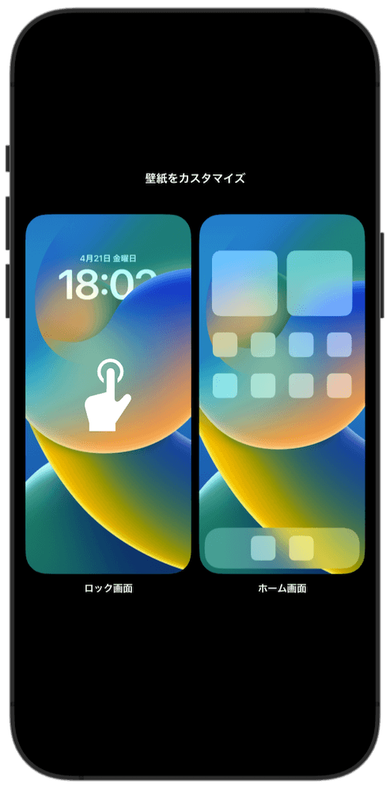
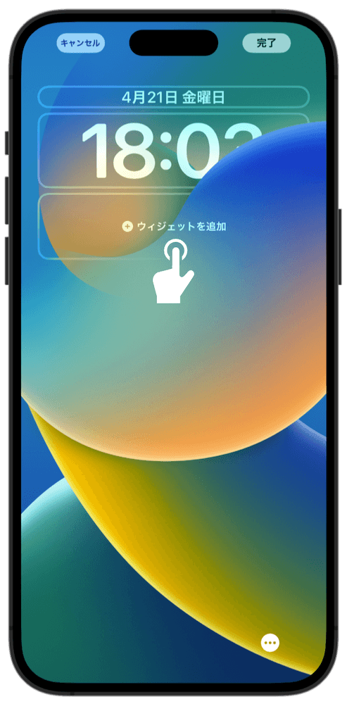
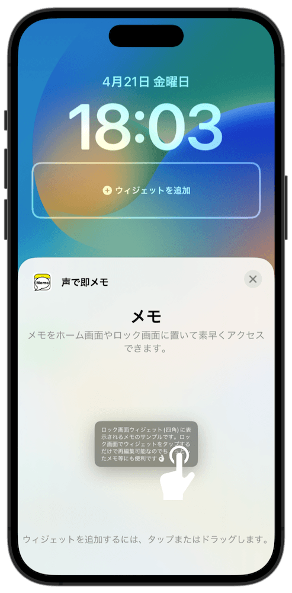

### 声で即メモ　アプリの使い方

#### 初めにやること

##### ウィジェットの追加

ウィジェットとして追加することで、そこから素早く起動してメモをとれるようになります。

ホーム画面への追加方法

 

- ホーム画面を長押しします

- 左上の +ボタン をタップします

- "声で即メモ"を検索してタップします

- スワイプして好みのサイズを選びます

- 青い決定ボタンをタップします

- ホーム画面をタップして完了です

ロック画面への追加方法 (四角メモ, iOS16)

 

- ロック画面を長押しします

- 「カスタマイズ」をタップします

- 「ロック画面」の方をタップします

- 「ウィジェットを追加」の部分をタップします

- "声で即メモ"を検索してタップします

- ウィジェットをタップします

- ロック画面をタップして確定します

- 「完了」をタップします

- ロック画面をタップします

- これで追加完了です
- ロック画面のウィジェットをタップすると、

- アプリのメモ画面が表示されます

ロック画面への追加方法 (1行メモ, iOS16)

 

- ロック画面を長押しします

- 「カスタマイズ」をタップします

- 「ロック画面」の方をタップします

- 日時が表示されている部分をタップします

- "声で即メモ"を検索してタップします

- ロック画面をタップして確定します

- 「完了」をタップします

- ロック画面をタップします

- これで追加完了です
- ロック画面のウィジェットをタップすると、

- アプリのメモ画面が表示されます

