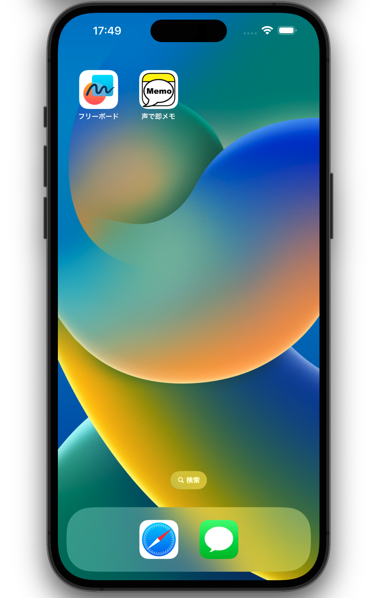

## 声で即メモ

アプリの使い方

### 初めにやること

#### ウィジェットの追加

ウィジェットとして追加することで、そこから素早く起動してメモをとれるようになります。

ホーム画面への追加方法

1. aaaaaaaaaaaaaaaaaaaaaaaaa

1. aaaaaaaaaaaaaaaaaaaaaaaaa
1. aaaaaaaaaaaaaaaaaaaaaaaaa
1. aaaaaaaaaaaaaaaaaaaaaaaaa

ロック画面への追加方法 (iOS16のみ)

1. aaaaaaaaaaaaaaaaaaaaaaaaa
1. aaaaaaaaaaaaaaaaaaaaaaaaa
1. aaaaaaaaaaaaaaaaaaaaaaaaa
1. aaaaaaaaaaaaaaaaaaaaaaaaa

