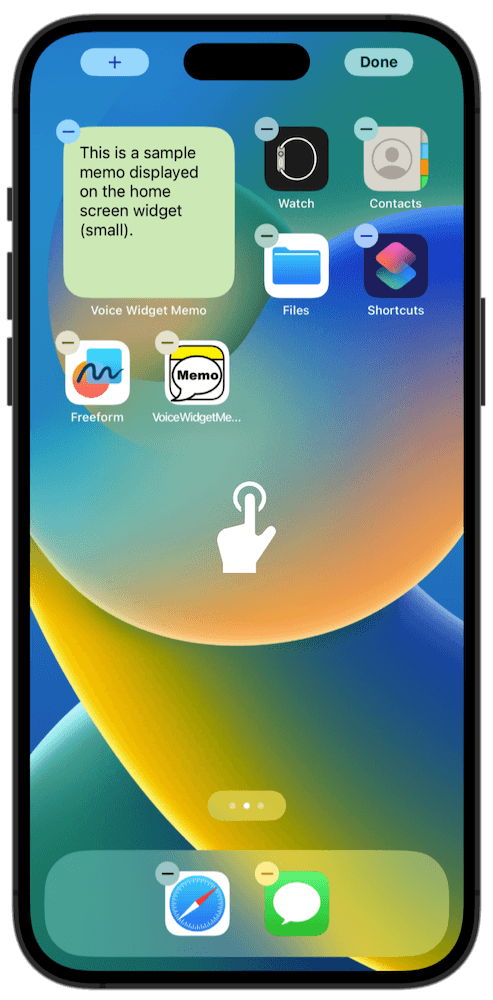
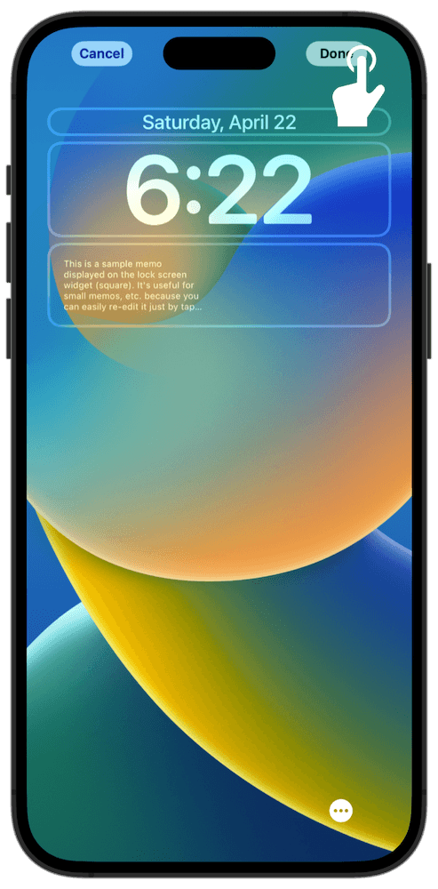
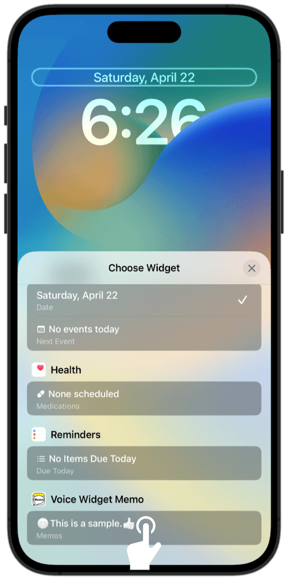

### How to use the "Voice Widget Memo"

#### Things to do first

##### Adding a widget

By adding memo as a widget, you can quickly launch the app from widget and take notes.

How to add to the home screen

 

- Long-press the home screen

- Tap the + button on the top left

- Search for "Voice Widget Memo" and tap it

- Swipe to choose your preferred size

- Tap the blue confirmation button

- Tap the home screen to complete

How to add to the lock screen (Rectangular memo, iOS16)

 

- Long-press the lock screen

- Tap "Customize"

- Tap "Lock Screen"

- Tap the "Add Widget" section

- Search for "Voice Widget Memo" and tap it

- Tap the widget

- Tap the lock screen to confirm

- Tap "Done"

- Tap the lock screen

- You have now completed adding memo
- When you tap the lock screen widget,

- The app's note screen will be displayed

How to add to the lock screen (Single line memo, iOS16)

 

- Long-press the lock screen

- Tap "Customize"

- Tap "Lock Screen"

- Tap the part where the date and time are displayed

- Search for "Voice Widget Memo" and tap it

- Tap the lock screen to confirm

- Tap "Done"

- Tap the lock screen

- You have now completed adding memo
- When you tap the lock screen widget,

- The app's note screen will be displayed

