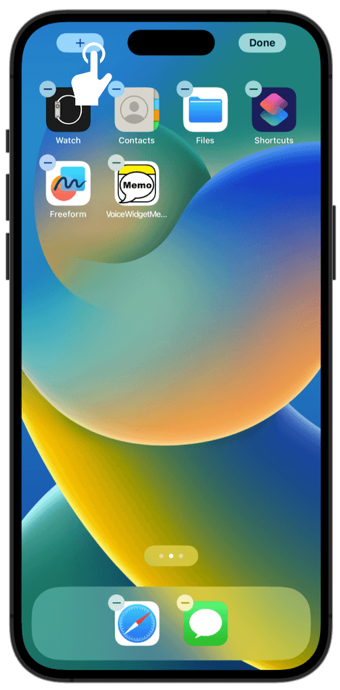
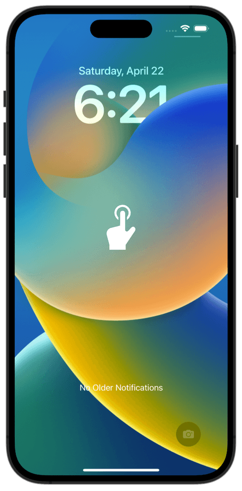
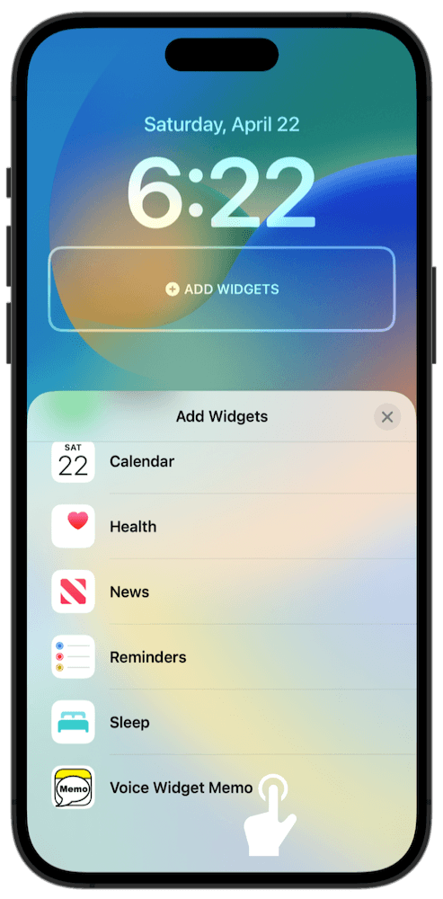
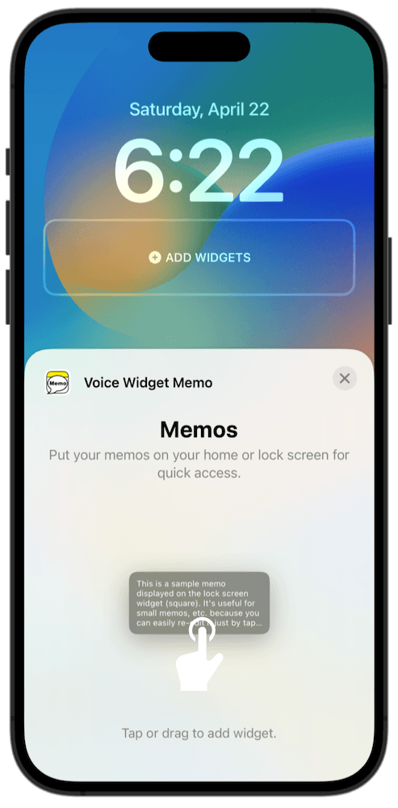
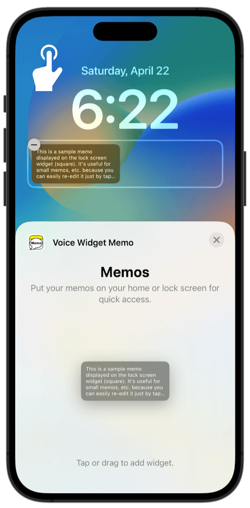
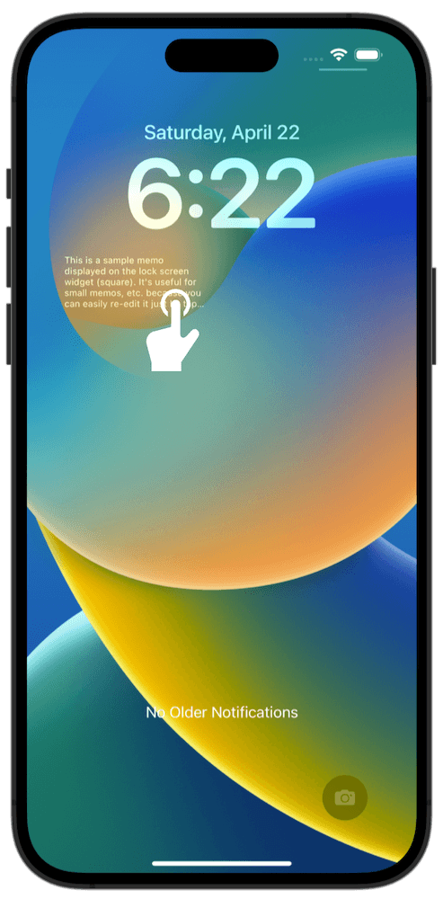
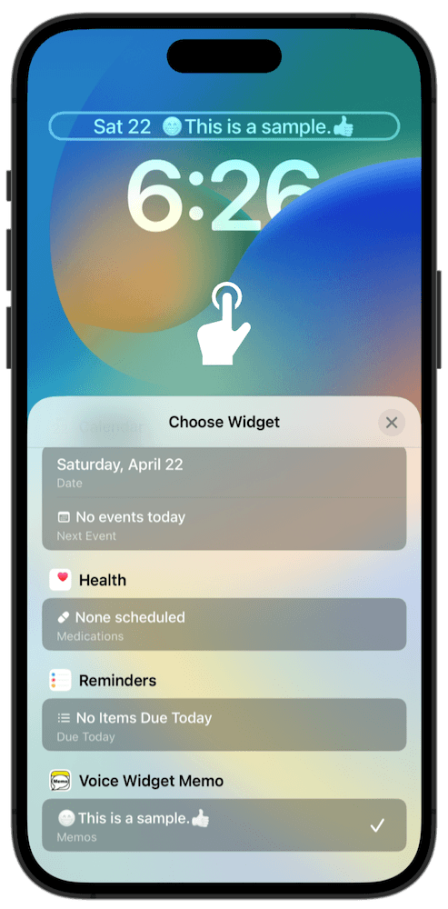
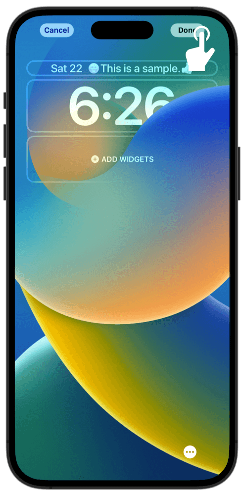
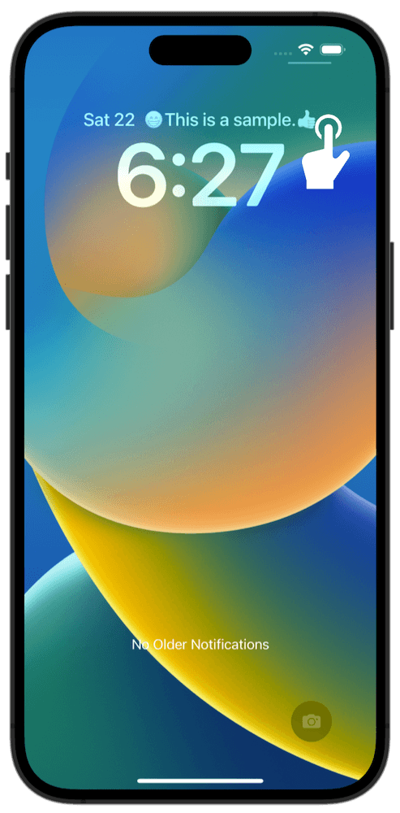
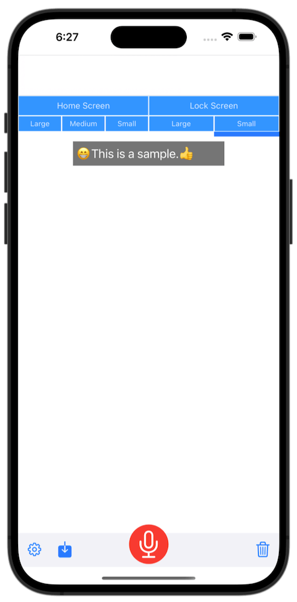

### How to use the "Voice Widget Memo"

#### Adding a widget

Memos can be added as widgets to the home screen or lock screen (iOS16 only) using the following method. Simply tap the added widget to start taking notes.

How to add to the home screen

 

- Long-press the home screen

- Tap the + button on the top left

- Search for "Voice Widget Memo" and tap it

- Swipe to choose your preferred size

- Tap the blue confirmation button

- Tap the home screen to complete

How to add to the lock screen (Rectangular memo)

 

- Long-press the lock screen

- Tap "Customize"

- Tap "Lock Screen"

- Tap the "ADD WIDGETS" section

- Search for "Voice Widget Memo" and tap it

- Tap the widget

- Tap the lock screen to confirm

- Tap "Done"

- Tap the lock screen

- You have now completed adding memo
- When you tap the lock screen widget,

- The app's note screen will be displayed

How to add to the lock screen (Single line memo)

 

- Long-press the lock screen

- Tap "Customize"

- Tap "Lock Screen"

- Tap the part where the date and time are displayed

- Search for "Voice Widget Memo" and tap it

- Tap the lock screen to confirm

- Tap "Done"

- Tap the lock screen

- You have now completed adding memo
- When you tap the lock screen widget,

- The app's note screen will be displayed

#### Hands-Free Mode

This is a mode for taking notes repeatedly by voice operation without touching the iPhone/iPad.

##### Preparation for use

First, you need to add the Siri shortcut for "Voice Widget Memo" by the following method.

How to add Siri Shortcut

 

- Tap "Hands-Free Mode" in the app's settings menu

- Tap "Add to Siri"

- Set your favorite voice phrase and tap "Done" (Default is "Voice Memo")

##### How to Use

Usage Flow

* Device must be unlocked
 
 

1. Say "Hey Siri, Voice Memo" to your iPhone/iPad (Match the second half with the voice phrase you set)
2. The app will start in recording mode, so record what you want to make a note of
3. Say "Finish" when you're done taking notes
4. The recording ends and the app hides in the background
5. If you want to make additional notes, repeat from step 1.

Tips

- By default, the content recorded in Hands-Free Mode is saved in "Home Screen: Large", but you can change the recording destination in the app settings.
- Voice command to end memo recording (default: "finish") can be changed in app settings

